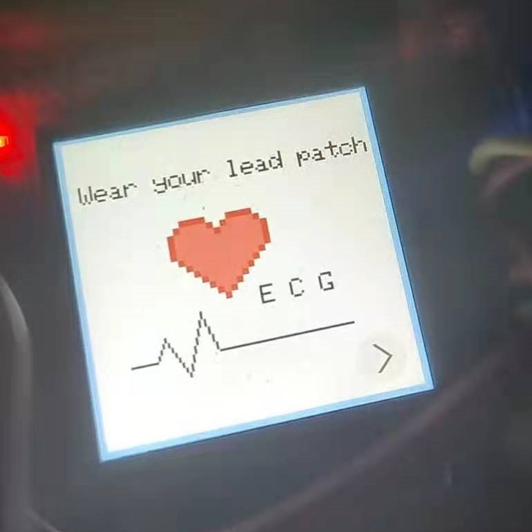
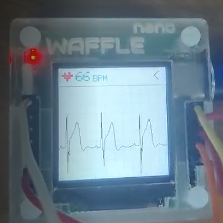
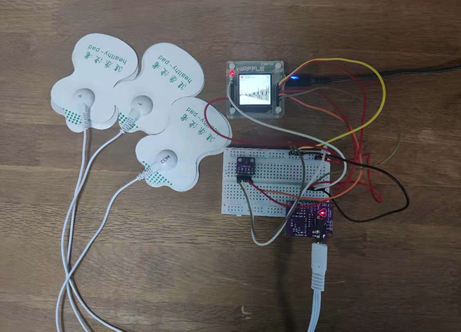
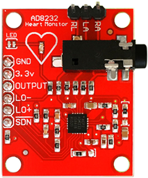
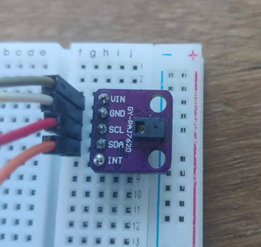
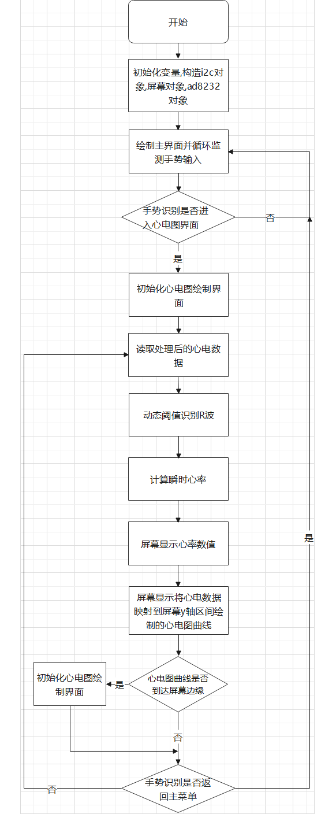
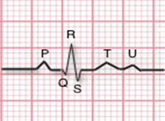
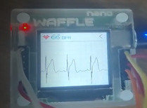
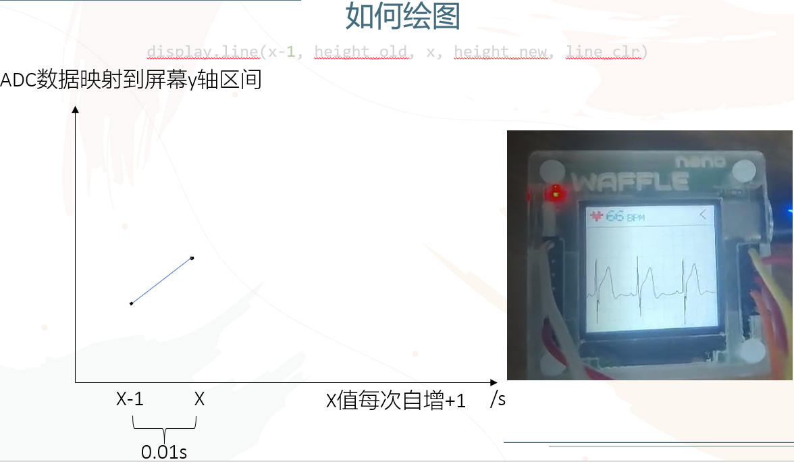

# 基于Waffle Nano的便携心电监测仪

## 前言

​	本次暑假短学期,在黑胡桃实验室做了个显示心电图和心率的小项目,本文主要讲解如何利用AD8232和Waffle Nano制作心电监测仪。开发环境点此[WaffleMaker](https://wafflenano.blackwalnut.tech/ide/index.html#/)

## 概览

​	

##### 	功能简介

​	1.显示实时心率

​	2.显示实时心电图

​	3.手势右划进入心电图界面，手势左划返回主界面

##### 	使用方法

​	使用时将配套的电极贴片的L端贴左胸，R端贴右胸，COM端贴左腹(顺便提一句，L和R端贴反会显示和原波形刚好相反的波形)



## 硬件部分



​	**AD8232**是一款用于心电信号测量及其他生物电测量的集成信号调理模块。该芯片可以在有运动或远程电极放置产生的噪声的情况下提取、放大及过滤微弱的生物电信号。该芯片使得模数转换器(ADC)或嵌入式微控制器（MCU）能够便捷的采集输出信号。

##### 	传感器接线

| Waffle Nano | 传感器                                                       |
| ----------- | :----------------------------------------------------------- |
| 3V3         | 3.3V                                                         |
| G02         | LO+                     #用于脱落检测                        |
| G14         | LO-                      #用于脱落检测                       |
| G05         | OUTPUT             #输出采集到的人体生理电信号               |
| GND         | GND                                                          |
| /           | SDN                     #可通过赋予高低电平使传感器进入启动或休眠状态，本次项目未使用 |

​	                                                                   

​                                                                               

​	**PAJ7260**手势识别传感器是将手势识别功能与通用I2C接口集成到单个芯片中的PAJ7620U2。它可以识别13种手势，包括向上移动，向下移动，向左移动，向右移动，向前移动，向后移动，顺时针方向，圆周 - 逆时针方向，向下，向下，从左到右，从左到右。这些手势信息可以通过I2C总线简单访问。

##### 	传感器接线

| Waffle Nano | 传感器 |
| ----------- | ------ |
| 3.3         | VIN    |
| IO1         | SCL    |
| IO0         | SDA    |
| GND         | GND    |

​	**st7789**屏幕连接所需spi接口已经由实验室预留好，直接插入即可。

## 驱动部分

##### 	AD8232驱动初始化

​	AD8232采集到的是电信号，我们需要的是数字信号，因此可以使用ADC(模数转换器)将电信号转换为数字信号用于之后的数据处理。Waffle Nano的多个引脚具有ADC功能，本次使用5号引脚。我写了个简单的库文件来调用AD8232。

```python
from machine import ADC, Pin
class AD8232:
    def __init__(self,analogPin,LO1Pin,LO2Pin): #ad8232初始化
        self.adc = ADC(Pin(analogPin))
        self.adc.equ(ADC.EQU_MODEL_8)
        self.LO1Pin = Pin(LO1Pin, Pin.IN)
        self.LO2Pin = Pin(LO2Pin, Pin.IN)
    def value(self,LO = 1):
        if LO == 1:
            return self.LO1Pin.value() #返回LO+,LO-电平值
        elif LO == 2:
            return self.LO2Pin.value()
    def read(self):
        data = self.adc.read() #读取心电数据
        return data

heartSensor = AD8232(analogPin = 5, LO1Pin=2, LO2Pin=14) #构造心电传感器对象
```

**PAJ7620驱动初始化**

​	PAJ7260手势识别在本次项目中只是辅助功能，我们需要传感器能检测左划和右划手势。7620本身已经写好算法可以判断我们作出的是何种手势，只需要向存储手势的寄存器读取数据即可。

使用方法简单来讲分三步 

1. 唤醒7620传感器

2. 向使能寄存器写入数据以控制7620传感器只识别需要的手势

3. 从手势识别中断标志寄存器读取数据来获得手势信息


​	PAJ7620连接协议为i2c，我们需要先构造i2c对象再对7620进行相关操作。因为我们只用到左划和右划手势，所以只需要将手势识别输出中断使能寄存器里的bit[2]和bit[3]设置为1，其余为0。

```python
i2c = I2C(1, scl=Pin(1), sda=Pin(0), freq=400000)
def InitialGestureRes(i2c):
    print(i2c.scan())  #115
    while True:
        i2c.write(115, b'\xEF')
        utime.sleep(0.01)
        flag = i2c.readfrom_mem(115, 0x00, 1)
        if flag ==[32]:
            break
    i2c.write(115, b'\xEF\x01')  #进入BANK1
    i2c.write(115, b'\x72\x01')  #使能工作
    i2c.write(115, b'\xEF\x00')  #进入BANK0
    print(i2c.readfrom_mem(115, 0x41, 1))   #获取当前哪些手势可以被识别
    i2c.write(115, b'\x41\x0C')  #设置为只有向左移动和向右移动可以被识别
    print(i2c.readfrom_mem(115, 0x41, 1))   #检测是否成功录入
    print(i2c.readfrom_mem(115, 0x43, 1))
    i2c.write(115, b'\xEF\x00')  #进入BANK0
```

​	要获取左划右划手势信息,我们需要从手势识别中断寄存器读取数据

```python
ges = i2c.readfrom_mem(115, 0x43, 1) #将读取出来的数据进行if条件判断即可实现我们想要的功能
```

**st7789屏幕驱动初始化**

```python
spi = SPI(0, baudrate=40000000, polarity=1, phase=0, bits=8, endia=0, sck=Pin(6), mosi=Pin(8)) #构造spi对象
display = st7789.ST7789(spi, 240, 240, reset=Pin(11,func=Pin.GPIO, dir=Pin.OUT), dc=Pin(7,func=Pin.GPIO, dir=Pin.OUT)) #构造屏幕控制对象
display.init() #屏幕初始化
```

## 程序流程图



## 算法部分

讲解一些重要的函数

**AD8232数据处理（算法滤波）**

  我们算法设置的采样频率为100HZ，即通过计时器每0.01s采集一个数据，这0.01秒内实际可获得51个左右的ADC数据，将ADC数据进行简单过滤(去掉一个最大值和最小值，再求算术平均)得出一个数据值，该值就是我们之后绘制心电图和计算心率实际用到的数据。同时由于我们除去计时器完成一次主循环所耗时间几乎可以忽略，所以计时器设置的0.01s就是完成一次数据采集耗费的时间，之后R-R间期的时间间隔可通过 循环次数*0.01s 计算得出。

```python
def fliter_adc(): #过滤0.01秒内的adc数据，取均值作为采样值
    global size
    start = utime.ticks_ms()
    while True:
        if(size < 70):
            if heartSensor.value(LO = 1) != 1 and heartSensor.value(LO = 2) != 1: #判断电极片是否脱落
                adc_data[size] = heartSensor.read()
                size +=1

        if(utime.ticks_diff(utime.ticks_ms(),start)>=sample_time*1000):
            break
    
    if size > 5:
        aver = (sum(adc_data[0:size]) -  max(adc_data[0:size]) - min(adc_data[0:size])) / (size -2)
    else:
        aver = 888
    
    size =0
    return aver
```


**心电数据读取**

```python
def ReadDataAndDropDetection():
    global heartSensor
    global line_clr        
    if heartSensor.value(LO = 1) == 1 or heartSensor.value(LO = 2) == 1: #判断电极片是否脱落
        print("!")
        line_clr = st7789.color565(255, 0, 0) #电极片脱落后曲线颜色变为红色，心率数字颜色变为红色作为脱落提示
        return 875
 
    else:
        line_clr = st7789.color565(0, 0, 0)
        return fliter_adc()   #读取心电传感器数据
```


**动态阈值识别R波与心率计算**



  我们观察绘制出来的波形以及网上搜到的心电图波形，可以看到特征鲜明(变化快，幅度大)的R波。心率可通过R-R间期来计算。所以我们的主要目标就是识别R波。最初我是根据他的斜率特征进行判别，当前数据值减去前一个数据值的差值(X的差值自然为一)即是斜率，通过设置一个阈值条件来判别，就可识别R波了。这样做确实能计算出心率，但是这样得出来的结果，稳定性不是很高。我们需要找寻一个更好的R波识别算法。在快速浏览网络上有关心率计算的文章后，我最后使用了一种动态阈值的算法来识别R波，本来此方法是用于通过脉搏计算心率的，脉搏传感器识别出来的数据波形是每个周期都只有一个明显波峰，而我们的波形一个周期内的高峰既有R波又有T波。但是没有关系，可以观察到R波和T波间隔时间极短，我们可以将间隔的时间也加入if条件以排除掉同一周期内的其他高峰。

**动态阈值识别R波**

```python
def Rwave_detection(readData):
    global preReadData
    global idx
    global num_filter, DATA_SIZE,mid,Flag,timeCount
    global data
 
    if readData - preReadData < num_filter:   #滤除突变噪声信号干扰
        data[idx] = readData                        #填充缓存数组
        idx += 1       
 
    if idx >= DATA_SIZE:
        idx = 0                       # 数组填满，从头再填
        max_data = max(data)          # 通过缓存数组获取波峰、波谷值，并计算中间值作为判定参考阈值
        min_data = min(data)
        mid = (max_data + min_data) / 5 * 2.65  #该系数可微调，升高或降低阈值
        num_filter = (max_data - min_data) / 2
 
    pre_Flag = Flag    
    if readData > mid:
        Flag =  1
    else: 
        Flag =  0
 
    if pre_Flag == 0 and Flag == 1 and timeCount > 35 and readData - preReadData >= 5:
        return True
    else:
        return False
```


**心率计算**

```python
def calcul_BPM():
    global timeCount, rCount, BPM
    rCount += 1
    rCount %= 2
    if rCount == 1: #两次心跳的第一次
        timeCount=0   
    
    elif rCount == 0: # 两次心跳的第二次
        if timeCount > 35:
            IBI = timeCount * sample_time     #计算相邻两次心跳的时间，得到 IBI，可以加上计时器时间以获得更精准的值
            BPM = 60 / IBI                  # 通过 IBI 得到心率值 BPM
            if BPM > 170:                   #限制BPM最高显示值
                BPM = 170
            elif BPM < 30:                  #限制BPM最低显示值
                BPM = 30
        else:
            rCount = 1
        timeCount=0
```


**心率显示**

```python
def draw_ECG():
    global heartSensorValue, height_new, height_old, line_clr
    y = int(heartSensorValue / 1200 * 240) - 100   
    height_new = 240 - y + 15
 
    if height_new <= 40:
        height_new = 180
    elif height_new > 239:
        height_new = 180
    display.line(x-1, height_old, x, height_new, line_clr)
    height_old = height_new
```


**心电图绘制**

​	本项目使用的显示屏模块为st7789，该模块具有在两点间画直线方法。我们将每一个可用数据赋予屏幕坐标，并两两连线，最后显示出来的效果就是心电图了。X值只需每次自增加一即可，Y值则需要将数据的大小映射到[0,240]区间。每次主循环我们都需要保存这次的屏幕坐标，在下一次循环中与新的数据坐标两点连线绘图。



```python
def draw_ECG():
    global heartSensorValue, height_new, height_old, line_clr
    y = int(heartSensorValue / 1200 * 240) - 100   
    height_new = 240 - y + 15
 
    if height_new <= 40:
        height_new = 180
    elif height_new > 239:
        height_new = 180
    display.line(x-1, height_old, x, height_new, line_clr)
    height_old = height_new
```


**手势识别监测**

```python
def StartDetection(): #判断是否进入心电绘制界面
    ges = i2c.readfrom_mem(115, 0x43, 1)
    if ges == [8]:
        display.fill_circle(207, 210, 18, st7789.color565(236, 236, 236))
        start_button()
        utime.sleep(0.1)
        print("start")
        return True
    else:
        return False
 
 
 
def ReturnDetection(): #判断是否返回主界面
    ges = i2c.readfrom_mem(115, 0x43, 1)
    if ges == [4]:
        display.fill_circle(220, 18, 15, st7789.color565(236, 236, 236))
        return_button()
        utime.sleep(0.1)
        print("return")
        return True
    else:
        return False
```

## 项目复现

​	[Github项目源码](https://github.com/Z-XINY/AD8232ECG)，相关细节见代码注释。

​	你需要准备Waffle Nano 、AD8232、PAJ7620、st7789、一块面包板以及杜邦线若干。在[WaffleMakerIDE](https://wafflenano.blackwalnut.tech/ide/index.html#/)上烧录ad8232.py和main.py就可以观察自己的心跳了。

